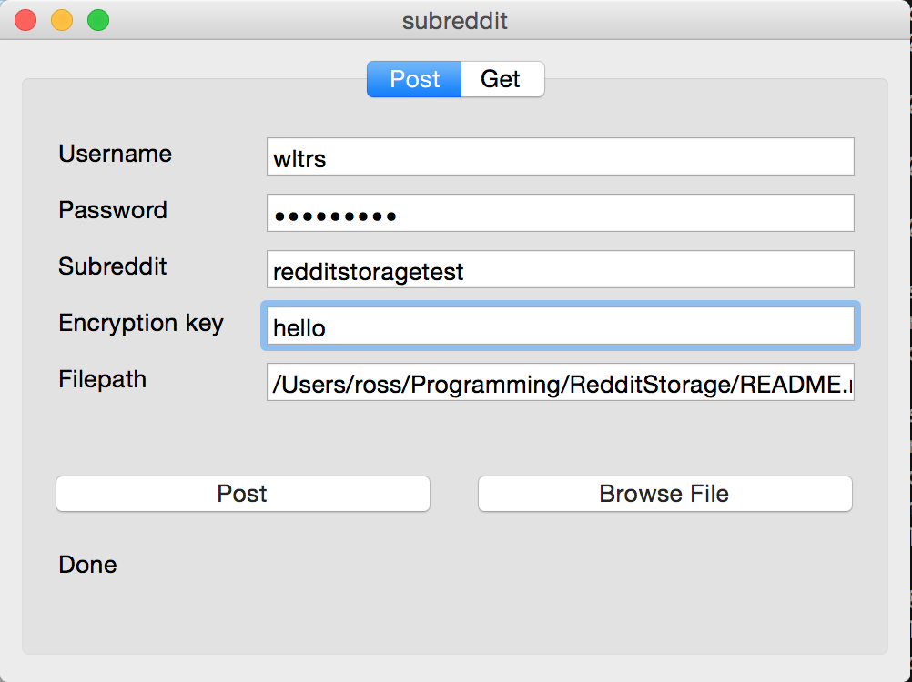
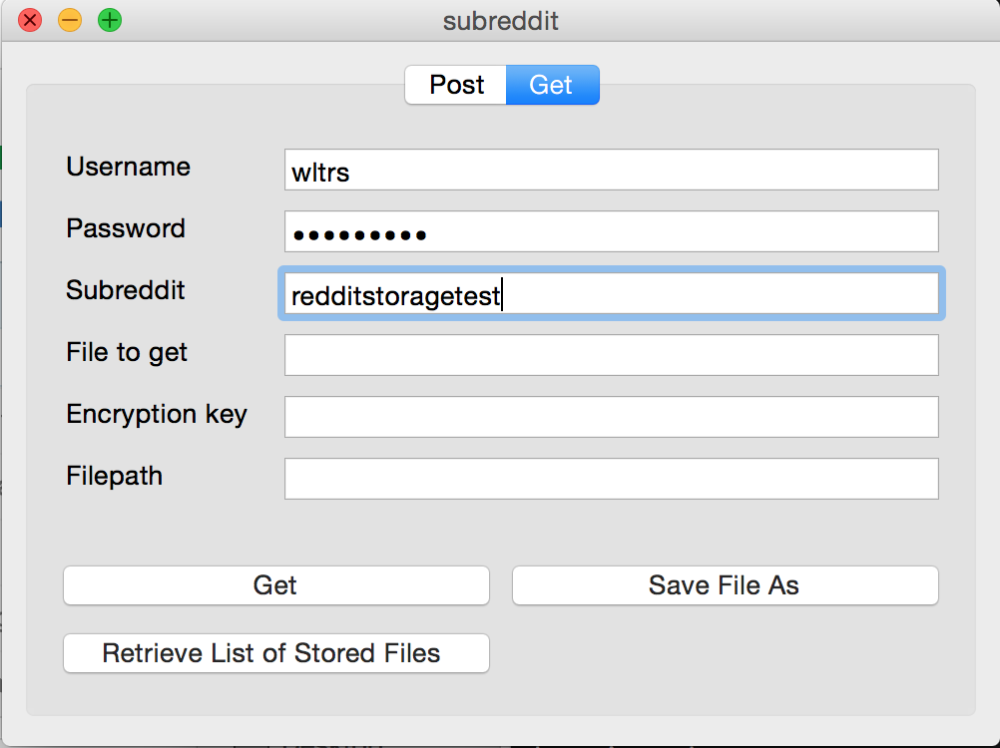
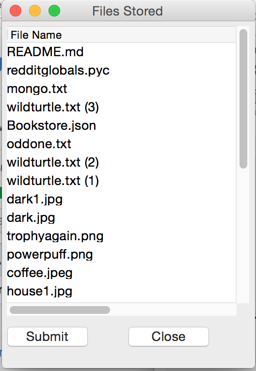
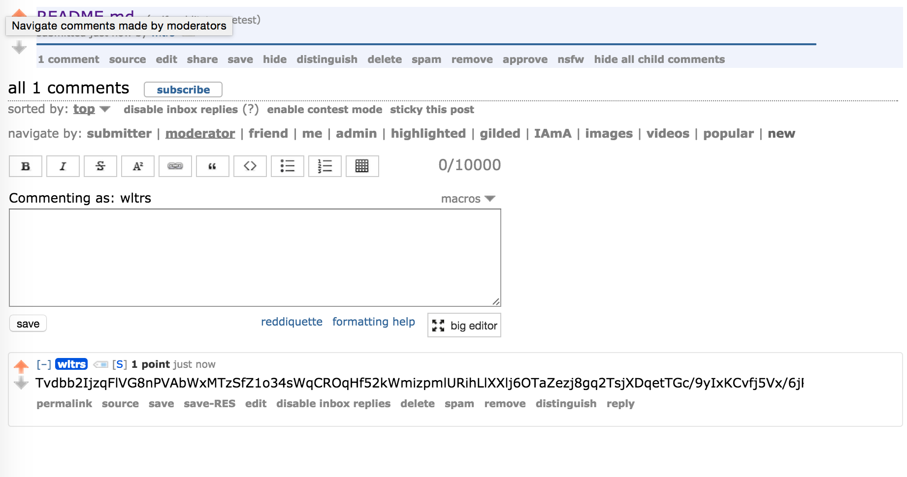
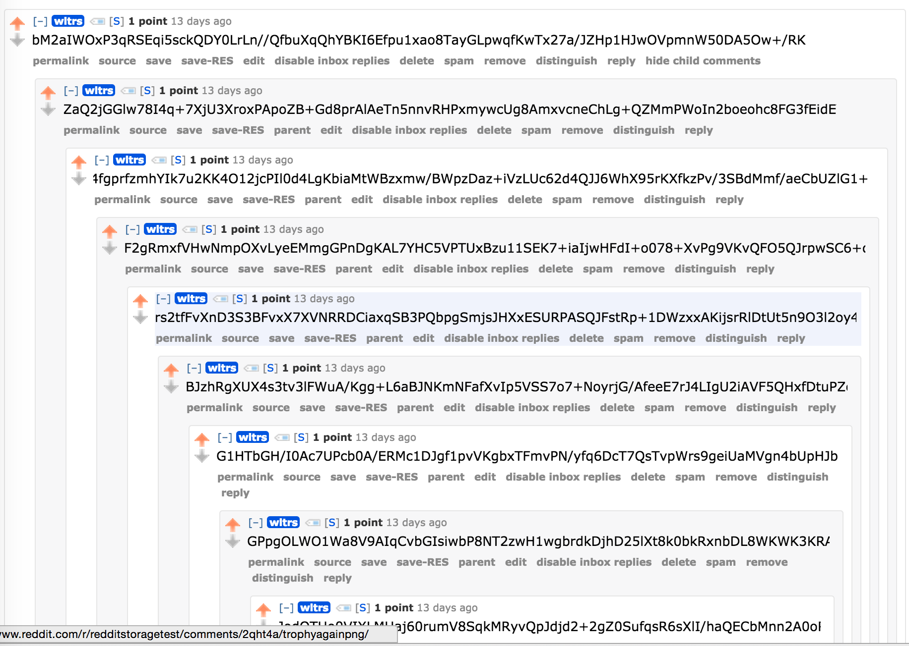

# RedditStorage
###### Cloud storage that uses Reddit as a backend. 

=============

RedditStorage is an application that allows you to store on reddit subreddits via raw bytes. The file is encoded into characters and encrypted using AES encryption, after which it can be stored on a subreddit of choice (ideally your own private subreddit). To retrieve the file, the process is simply reversed. Unfortunately, reddit comments have a character limit of 10000. If your file exceeds that amount, it will be split up among comments in the same thread which form links by replying to each other. 

=============

## Requirements:
* A Reddit account (preferably with over 1 link karma on it)
* A private subreddit with your reddit account as a moderator (make sure to set the spam filter strength of self posts and comments to "low")
* praw 7.7.0
* Python 3.5+ (and Pip3)
* pycryptodome 3.17
* wxPython 3.0
* Pypubsub 4.3.0

### Required Files
You'll need a few things first:
1. A config file named `praw.ini` to be used with `configparser`. See an example here of what the format should look like: [example_praw.ini](/example_praw.ini)
2. Fill out `redditglobals.py` with the label you're using in the `praw.ini` file.
    1. Replace `reddit storage bot` with whatever label you set in between the square brackets in your `praw.ini`

### Python installation:

#### All Operating Systems:

Download the latest version of Python from [here](https://www.python.org/downloads/). Pip is included by default.

#### Linux only

If you can't use a browser for whatever reason, run this instead:

```shell
sudo apt-get install python3 python3-pip
```

### Package installation:

```shell
pip install praw pycryptodome wxpython pypubsub
```


=============

## Usage:

### Start-up:
```shell
python main.py
```

### Posting files

1. Enter the encryption key to be used to encrypt the files. Treat this like a normal password. *If you lose this, we can't help you decrypt it*
2. Choose the file you want to upload.
3. Press `Post`.

*The window may say "Not Responding" or freeze if you choose large files. This is normal and you need to wait it out.*

### Downloading files

1. Enter the name of the file to get. *It takes some time for Reddit's search index to update (about every 20 minutes). You should check that you can find it using Reddit's search feature first before running this.*
2. Enter the encryption key you used to encrypt the file when posting it. 
3. Click `Save File As` and select a location and name to save the file as. Alternatively, enter the save location manually.
4. Press `Get`.

*As before, the window may say "Not Responding" or you may get the beachball of death on MacOS. Again, just wait it out.*

### Screenshots


===========







## To Do

==============

* Upload as webapp
* Auto generate subreddits